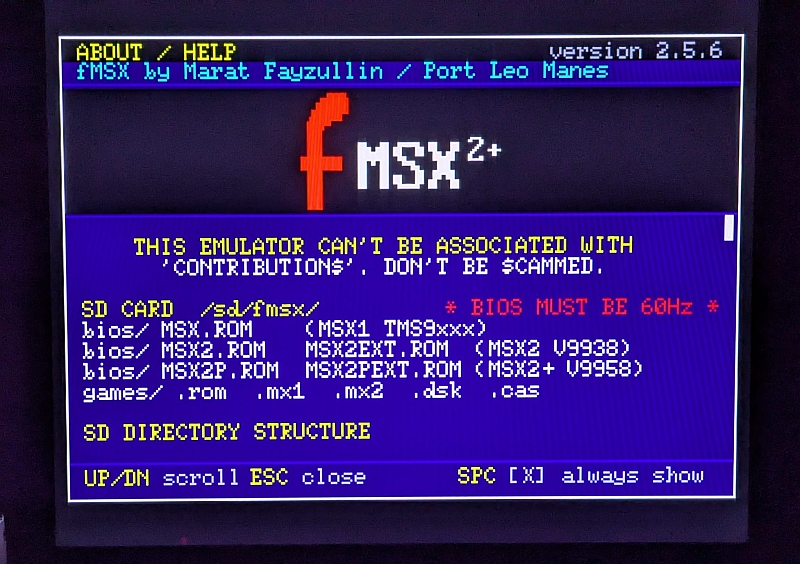

# fMSX2+ Version 2.5.6 - ESP32 / TTGO VGA32-V1.4
 

 
A tiny MSX1, MSX2 and MSX2+ emulator (fMSX core by Marat Fayzullin) running on a LilyGO TTGO VGA32 v1.4 
VGA out, PS/2 keyboard, microSD. It can boot to the Game Menu, MSX-Basic, MSX-DOS or NEXTOR. 
 

---

The TTGO-ESP-VGA32 can barely run the fMSX2+ core so if you find a game that seems slow you can use: 
Frameskip->F8 / Turbo->F10 to try to speed things up a little, but in general games run properly.

---

<b>Flash it using Flash Download Tool </b>  
<code>firmware_full.bin</code> and write it at <code>0x0</code> 

---

<b>sd card layout</b>  
Format the card FAT32 (or FAT16 if you plan to use Nextor mode -- Nextor requires FAT16 to access the SD card). 
If you are going to use NEXTOR you can format the sd card using the option in the F11 screen (keep in mind that it will wipe the sd card clean).  

<code>SD:/</code> 
&nbsp;&nbsp; <code>COMMAND2.COM</code> &nbsp; <code>NEXTOR.SYS</code> &nbsp;&nbsp; (Nextor mode only -- place on SD root) 
&nbsp;&nbsp; Confirmed to work with NEXTOR.SYS v:2.1.2 and COMMAND2.COM v:2.4.4 
 
<code>SD:/fmsx/bios/</code> 
&nbsp;&nbsp; <code>MSX.ROM</code> &nbsp;&nbsp;&nbsp;&nbsp;&nbsp;&nbsp;&nbsp;&nbsp;&nbsp;&nbsp;&nbsp;&nbsp;&nbsp;&nbsp;&nbsp;&nbsp;&nbsp;&nbsp;&nbsp;&nbsp; MSX1 BIOS V9xxx 
&nbsp;&nbsp; <code>MSX2.ROM</code> &nbsp; <code>MSX2EXT.ROM</code> &nbsp;&nbsp;&nbsp;&nbsp;&nbsp; MSX2 V9938 
&nbsp;&nbsp; <code>MSX2P.ROM</code> &nbsp; <code>MSX2PEXT.ROM</code> &nbsp;&nbsp;&nbsp;&nbsp; MSX2+ V9958 
&nbsp;&nbsp; <code>DISK.ROM</code> &nbsp; <code>FMPAC.ROM</code> &nbsp; <code>MSXDOS2.ROM</code> 
&nbsp;&nbsp; <code>NEXTOR.ROM</code> &nbsp; <code>CARTS.SHA</code> 
&nbsp;&nbsp; optional: <code>KANJI.ROM</code> &nbsp; <code>RS232.ROM</code> &nbsp; <code>CMOS.ROM</code> 
 
<code>SD:/fmsx/games/</code> 
&nbsp;&nbsp; <code>DSK/</code> &nbsp; <code>CAS/</code> &nbsp; <code>MSX1/</code> &nbsp; <code>MSX2/</code> &nbsp; <code>SCC/</code> &nbsp; <code>FM/</code> 
&nbsp;&nbsp; <code>.rom</code> &nbsp; <code>.mx1</code> &nbsp; <code>.mx2</code> &nbsp; <code>.dsk</code> &nbsp; <code>.cas</code> 
 
BIOS must be 60Hz. Switch VDP model in F11 settings. 

---

<b>BIOS</b>  
dump them from your real MSX and drop them into <code>/sd/fmsx/bios</code> 
BIOS must be 60Hz. Switch VDP model in F11 settings.  
MSX1 
• <code>MSX.ROM</code> - main BIOS + BASIC 

MSX2 (V9938) 
• <code>MSX2.ROM</code> - main BIOS + BASIC 
• <code>MSX2EXT.ROM</code> - sub-ROM / extensions 

MSX2+ (V9958) 
• <code>MSX2P.ROM</code> - main BIOS + BASIC 
• <code>MSX2PEXT.ROM</code> - sub-ROM / extensions 

Other files needed in the BIOS folder: 
• <code>CARTS.SHA</code> - auto mapper selector - visit romdb.vampier.net 
• <code>DISK.ROM</code> - Floppy driver 
• <code>FMPAC.ROM</code> - FM driver 
• <code>MSXDOS2.ROM</code> - DOS driver 
• <code>NEXTOR.ROM</code> - Nextor MSX-DOS (required for Nextor mode) 

---

<b>msxdos2 boot</b>  
Save a <code>MSXDOS.dsk</code> into <code>/sd/fmsx/games/dsk</code>, load the disk using F12 and then select boot to DOS in F11 
 
If you are not booting to DOS and just want to boot to a DSK, select the DSK using F12 and press CONTROL+ALT+DEL to reboot (or in the F12 screen you can press INS to reboot).

---

<b>nextor mode</b>  
Nextor is a modern MSX-DOS replacement that boots directly from the SD card. 
Press F11 and select <code>BOOT</code> > <code>NEXTOR</code> -- the emulator will reboot into Nextor. 
 
The SD card must be formatted as FAT16 for Nextor to boot and access the sd card. Format the sd using the option available on F11. 

---

<b>F11 settings</b>  
Press F11 to open the settings screen. Changes that require a reboot are applied when you press ESC to close.  

<b>Floppies</b> 
Enables virtual floppy drives A and B. Disk images (.dsk) are loaded via F12. 
Changing this setting requires a reboot.  

<b>Arrows</b> 
Routes the keyboard arrow keys to the MSX. 
• <code>KBD</code> &nbsp;&nbsp;&nbsp;&nbsp;&nbsp;&nbsp; cursor keys only (default) 
• <code>KBD+JOY</code> &nbsp; cursor keys + joystick port 1 simultaneously 
• <code>JOY</code> &nbsp;&nbsp;&nbsp;&nbsp;&nbsp;&nbsp; joystick port 1 only  

<b>Volumes</b> 
Sets the mix level (0-10) and on/off toggle for each sound chip. 
• <code>PSG</code> (AY-3-8910) -- default vol 5, ON 
• <code>SCC</code> (Konami) -- default vol 3, ON 
• <code>FM</code> (YM2413) -- default vol 3, ON. Turning FM OFF improves performance on slow games. 

---

<b>keys</b>  
• <b>F6</b> &nbsp;&nbsp; about / help screen 
• <b>F7</b> &nbsp;&nbsp; launch The File-Hunter WiFi browser app 
• <b>F8</b> &nbsp;&nbsp; frame-skip - cycles QUALITY / NORMAL / SPEED (default) 
• <b>F9</b> &nbsp;&nbsp; manual mapper override (use if a ROM loads incorrectly. Hit it when the game is booting) 
• <b>F10</b> &nbsp; CPU turbo - cycles 3.58MHz up to ~7.16MHz in +20% steps 
• <b>F11</b> &nbsp; settings - VDP model, boot mode, PSG / SCC / FM volume and enable, disk mode 
• <b>F12</b> &nbsp; game list - loads <code>.rom</code> <code>.mx1</code> <code>.mx2</code> <code>.dsk</code> <code>.cas</code> - INS remounts SD card, END resets MSX 
• <b>Ctrl+Alt+Del</b> &nbsp; warm MSX reset 

---

<b>How do you get the bios files?</b>  
For the MSX1 bios I used my Sanyo SPC: 
• <code>spc800bios.rom</code> renamed to <code>MSX.ROM</code> 
 
For the MSX2 bios I used my Panasonic FS-A1mk2: 
• <code>fs-a1mk2_basic-bios2.rom</code> renamed to <code>MSX2.ROM</code> 
• <code>fs-a1mk2_msx2sub.rom</code> renamed to <code>MSX2EXT.ROM</code> 
 
For the MSX2+ bios I used my Sanyo WAVY FD-70 
• <code>phc-70fd2_basic-bios2p.rom</code> renamed to <code>MSX2P.ROM</code> 
• <code>phc-70fd2_msx2psub.rom</code> renamed to <code>MSX2PEXT.ROM</code> 

---

<b>credits</b>  
fMSX core by Marat Fayzullin 
